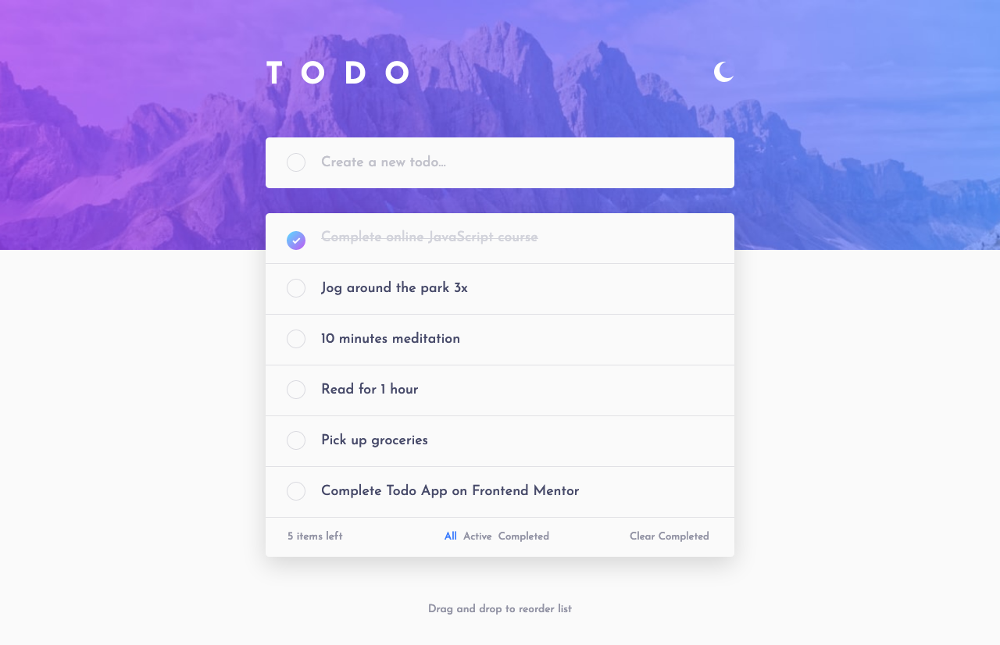

# TODO App

Simple todo app with frontend features based on `localStorage` data. To learn more about this project follow the brief section below for context.

### Setup

To get started, you'll want to install dependencies:

```shell
npm install
```

To run this project you'll want to run:

#### Development

```shell
yarn dev
```

#### Production

```shell
yarn build && yarn start
```

In both modes you will be prompted to visit the app in the specified localhost port.

#### Testing

This handles e2e testing of the application. I didn't feel there were enough complex components to unit test for this project so I stuck with e2e testing functionality for desktop and mobile browsers. You'll also notice I've put in some screenshots to show off what the application looks like in comparison to the original mockups.

```shell
# Before your first run install playwright
npx playwright install

# To run the test suite
yarn test
```

#### Screenshots



### Objective

Your challenge is to build out this todo app and get it looking as close to the design as possible.

### Brief

Using TypeScript and React, your task is to build out the project to the designs inside the `/design` folder. You will find both a mobile and a desktop version of the design to work to. The designs are in JPG static format. This will mean that you'll need to use your best judgment for styles such as `font-size`, `padding` and `margin`. There is also a `style-guide.md` file, which contains the information you'll need, such as color palette and fonts.

Your users should be able to:

- [x] View the optimal layout for the app depending on their device's screen size
- [x] See hover states for all interactive elements on the page
- [x] Add new todos to the list
- [x] Mark todos as complete
- [x] Delete todos from the list
- [x] Filter by all/active/complete todos
- [x] Clear all completed todos
- [x] Toggle light and dark mode
- [x] **Bonus**: Drag and drop to reorder items on the list

### Evaluation Criteria

- **TypeScript** best practices
- Show us your work through your commit history
- We're looking for you to produce working code, with enough room to demonstrate how to structure components in a small program
- Completeness: did you complete the features?
- Correctness: does the functionality act in sensible, thought-out ways?
- Maintainability: is it written in a clean, maintainable way?
- Testing: is the system adequately tested?
